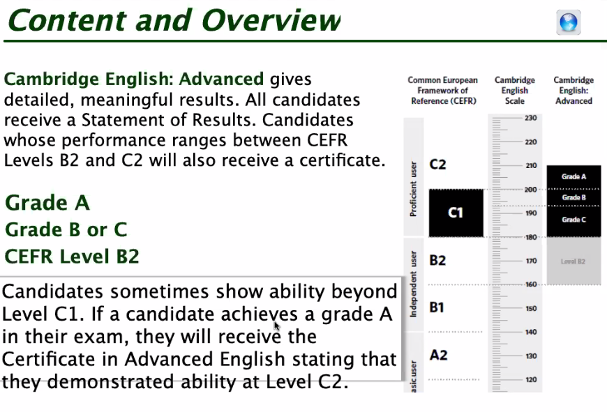

# CAEP

[Font Cambridge Web Site](https://www.cambridgeenglish.org/exams-and-tests/advanced/results/)

## Paper 2 - Writing

- **Part 1:** Compulsory
- **Part 2:** One task from a choice of three

- **Register ==** Formal or informal language

## Paper 3 - Listening

### Part 1: Multiple-Choice

### Part 2: Sentence Completion

### Part 3: Multiple-Choice

### Part 4: Multiple-Matching

## General Tips

## General Parts

[20220514](./resources/20220514%20df727b0ead3d4f03a85332bd77e3721c.md)