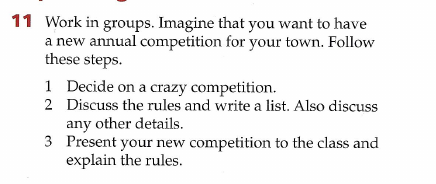

# Unit 2

## 2a

### Subject

- competitive sports

### Grammar `verb + -ing` forms (gerunds)

We can use -ing forms of verbs in the same way that we use nouns – as the subject, object or complement of a verb. We often refer to-ing forms used in this way as gerunds:

- **Subject** of the sentences
    - **Swimming** is good for you
    - Winning isn’t everything, but wanting it is
    - Eating a lot of fruit is important
- **After verbs** (ofen like, love, enjoy, prefer, hate, can’t stand, don’t like) as an **object**
    - I like playing tennins;
    - I just love winning;
    - I hate losing;
    - I love waking in the mountains;
    - The hardest thing about learning English **is understanding** the gerund;
    - One of life's pleasures **is having** breakfast in bed;
    - **Only a gerund can follow these verbs:**
        - admit, advise, avoid, be used to, can’t help, can’t stand, consider, deny, discuss, dislike, end up, enjoy, feel like, finish, forget, get used to, give up, go on, have difficulty, have problems, have trouble, imagine, it’s no use, it’s worthwhile, keep, look forward to, mention, mind, miss, recommend, remember, quit, spend time, stop, suggest, understand, waste time, work at.
- **After a preposition (complement)**
    - I’m very good at playing tennis
    - I’m good at learning languages
    - Everyone else is afraid of winning
- Gerund in **compound nouns**
    - I am giving Sally a **driving lesson**.
    - They have a **swimming pool** in their back yard.
    - I bought some new **running shoes**.
- Gerund after some expressions
    - She **couldn't help falling** in love with him.
    - I **can't stand being** stuck in traffic jams.
    - It's **no use trying** to escape.
    - It might **be worth phoning** the station to check the time of the train.

### Grammar `would`

The word `would` can be used for functions, such as:

- expressing desire, polite requests and questions, opinion or hope, wish, regret and future ambitions
    - I’d like to visit Kenya next year
    - She wouldn’t like to work in a office when she leaves the school

**TODO - Advanced uses of `would`**

```jsx
[https://www.dailystep.com/en/blog/using-would-english-part-2-plus-british-protests](https://www.dailystep.com/en/blog/using-would-english-part-2-plus-british-protests)

[https://www.dailystep.com/en/blog/advanced-uses-would-english-part-3-plus-lake-district](https://www.dailystep.com/en/blog/advanced-uses-would-english-part-3-plus-lake-district) 

[https://www.englishclub.com/grammar/verbs-modal-would.htm](https://www.englishclub.com/grammar/verbs-modal-would.html)

[https://learningenglish.voanews.com/p/5611.html](https://learningenglish.voanews.com/p/5611.html)

[https://www.dailystep.com/en/blog/would-english-grammar-part-4-plus-royal-wedding](https://www.dailystep.com/en/blog/would-english-grammar-part-4-plus-royal-wedding)

[https://www.dailystep.com/en/blog/how-use-would-part-1-plus-british-isles-great-britain-or-uk](https://www.dailystep.com/en/blog/how-use-would-part-1-plus-british-isles-great-britain-or-uk)

[https://www.dailystep.com/en/blog/using-would-english-part-2-plus-british-protests](https://www.dailystep.com/en/blog/using-would-english-part-2-plus-british-protests)
```

### Vocabulary

- course
    - you play golf on a golf course
- club
    - you need a golf club and a ball
- pitch (~field [us])
    - an area of ground where a sport is played
    - you play football on a football pitch
- court
    - an area for playing a sport
    - you play tennis on a tennis court. You need a net, a racquet and balls
- You **do boxing** in a ring. You need a boxing gloves
- You **do motor racing** on a track. You need gloves, goggles and a racing car

### References

- [EF English Grammar: Gerund](https://www.ef.com/wwen/english-resources/english-grammar/gerund/)
- [ILTS Material English Grammar: Gerund](https://ieltsmaterial.com/advanced-grammar-for-ielts-verb-ing-forms-and-infinitives/)
- [VOA English Grammar: Gerund](https://learningenglish.voanews.com/a/everyday-grammar-gerunds-infinitives/2722827.html)

## 2b

### Subject

- crazy competitions
- rules of the competition

### Grammar Modal Verbs

- Necessary and an obligation: `must`  and `have to`
- Allowed: `can`
- Not necessary (but allowed): `don’t have to`
- Not allowed: `mustn’t` and `can’t`

### Grammar `I had never` vs `I have never`

**Context**

Just imagine you are at some music performance now and you are listening your favourite band. Then, the band start to play its new song and you it is the first time you are listening to this song and you want to tell it to your friend. Which way is the correct way to say it?

1. "I **have** never heard this song before this performance"
2. "I **had** never heard this song before this performance"

**Answer**

Because you are talking to your friend right now, you say "I **have** never heard this song before **this** performance".

If you were telling your friend about your experiences after the performance had finished you would say "I **had** never heard **the** song before **that** performance.

### Vocabulary

- referee
    - There are two teams and a referee

### Writing

**DONE**



1. **The World Longest Race**
The world's longest race is a motorsport competition that accepts any type of land vehicle. The race has a length of 22,387km. It starts in Cape Town, South Africa and has its finish point at Magadan, Russia. The world's longest race is an endurance test for the machines used in the competition. Through the race path, there are going to be several types of environments like deserts, forests, dumps and even cities which are going to put the competitors and their equipment to the test.

**OR**

Along the track, various types of environments such as deserts, forests, dumps and even cities will put competitors and their equipment to the test.
2. **Rules**
    1. You must have a motorised land vehicle such as a motorcycle, car, etc;
    2. You cannot change vehicle during the competition;
    3. You can repair damaged vehicle's components;
    4. You can have a team with a maximum of 10 participants for the competition;
    5. You must follow the routes given in your GPS and maps;
    6. You cannot have your vehicle transported by another during the competition.

## 2c

### Subject

- reading an unusual sport

### Vocabulary

- turn vs spin
    - turn is moving round in general
    - spin is continually moving round very fast
- scream vs shout
    - scream is a loud noise in the throat showing excitement or fear
    - shout is saying words loudly
- audience vs spectators
    - audience is used for people at the theatre, cinema or concert
    - spectators are people watching a sporting event
    

### Speaking

**TODO**


## 2d

### Subject

- speaking about clubs and membership
- talking about interests

### Vocabulary

- tab into sth
    - to manage to use something in a way that brings good results
    - if only we could tap into that energy and creativity;
    - are you tapping into your staff’s full potential;
    - several other companies were already tapping into this market;
    - the building tapped into the city’s water supply;
    - The company is hoping to tap into the Chinese market;
    - Our country successfully participated in helping the economies of these countries and now we can tap into this potential;
    - The senator has the ability to tap into the American psyche;
    - The politician tapped into voter anger and won the election (~ o político se aproveitou da raiva dos eleitores e ganhou a eleição);
    - Lets tap into we are learning the meaning of tapping into and practice it in or next speaking exercise.
- pad sth out
    - *To add words, information, etc. to make something seem longer or better*
    - She had to pad the presentation out to make it last half an hour
    - *o make something such as an article, seem longer or more impressive by adding things that are unnecessary*
    - *The report was padded out with extracts from previous documents.*
- Social butterfly
    - A social butterfly is someone who is social or friendly with everyone, flitting from person to person, the way a butterfly might.
    - I’m a bit of a social butterfly, so I tend to spend my free time with friends.
- ill-intentioned
    - **having malicious intentions**
    - an ill-intentioned criticism that was meant more to hurt than to help.

### Extra material

```jsx
https://www.youtube.com/watch?v=bYpCITiVu38 [DONE]
https://www.youtube.com/watch?v=hoyhPZDp3dE [DONE]
https://www.youtube.com/watch?v=oADRAv9zmRA [DONE]
https://www.youtube.com/watch?v=dOw3G0hi4ys
https://www.youtube.com/watch?v=cxo5KhFgkWk
```

### Speaking

- **I’m Interested in + noun/gerund**
    - **I’m interested in** football. My favourite team is Chelsea;
    - **I’m interested in** watching football, but I don’t like to play myself.
- **I’m keen on + noun/gerund**
    - I’m keen on swimming. I try to get to the swimming pool at least twice a week;
    - I’m keen on sport. I especially love swimming.
- **I’m into + noun/gerund**
    - These days I’m really into reading. I can’t get enough of a good thriller
- **I enjoy + noun/gerund**
    - I have always enjoyed a trip to the cinema. I particularly love a good action movie;
    - I enjoy going to the cinema. I try to go every Tuesday as it’s half price on those days;
    - I enjoy cycling because it keeps me fit;
    - Sometimes, I enjoy going jogging.

> I have been getting a little bored over the holidays
> 

> I’ve actually got to go soon as i have a guitar lesson
> 

> I’ve got to head off now
> 

> Lovely to catch up with you
> 

> I started cycling when I was on vacation in Caraguatatuba. I’ve been cycling for 2 months. I decided to do cycling because I would like to improve my balance**.**
> 

> When I was younger my uncle got me into football.
> 

**TODO**


**DONE**


